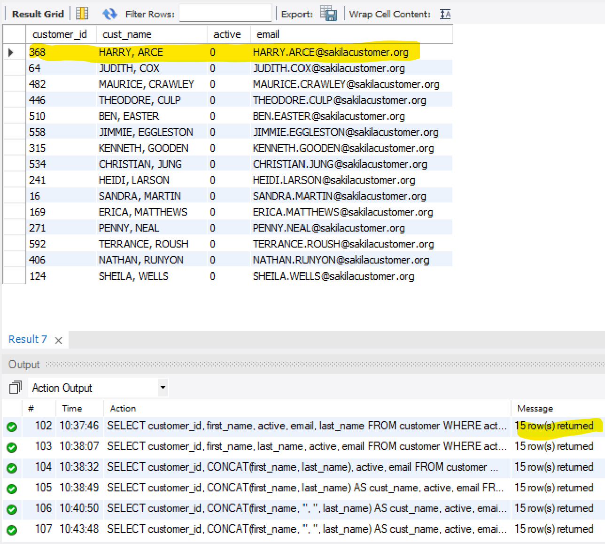
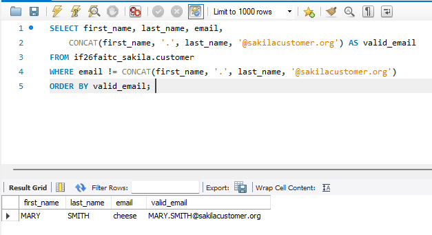
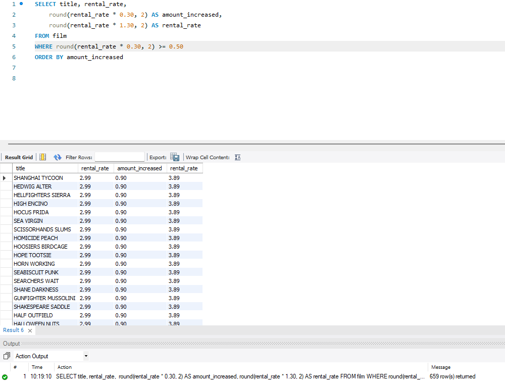
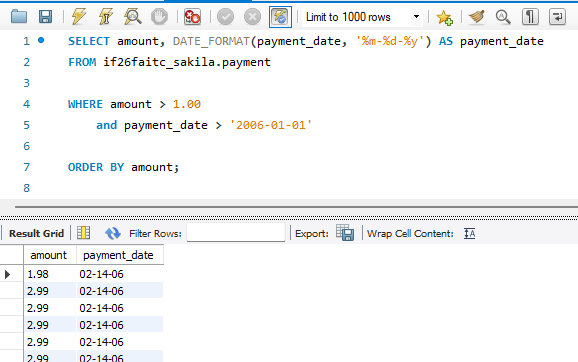
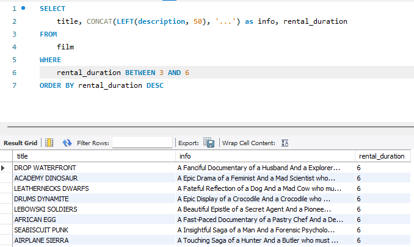
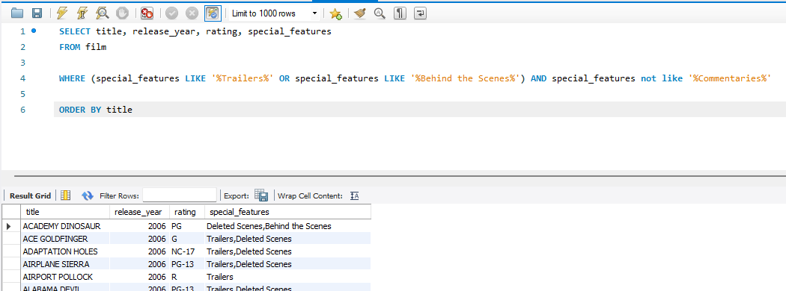
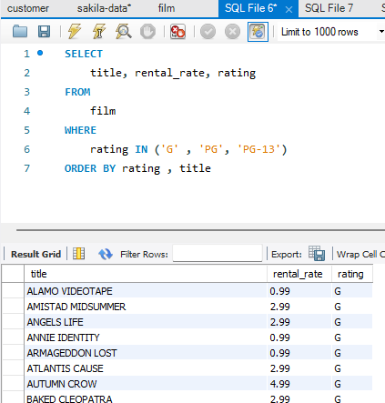
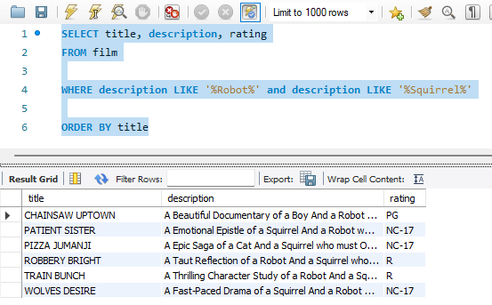
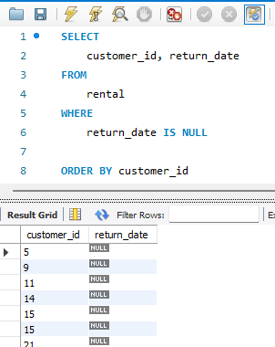
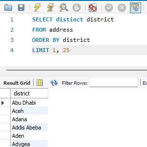

# MySQL_Chapter3
Assignment Repository

## Summary

This assignment is 10 queries on the Sakila database to show knowledge of the concepts in the following list. These queries contain many of the basics of SQL.

 1. SELECT clause
   - a. arithmetic expression
   - b. column aliases
   - c. DISTINCT
   - d. LIMIT
2. Functions:
  - a. CONCAT
  - b. LEFT (RIGHT)
  - c. ROUND
  - d. CURRENT_DATE
  - e. DATE_FORMAT
3. WHERE clause
  - a. comparison (relational) operators
  - b. logical operators
  - c. IN and BETWEEN operator
  - d. LIKE and REGEXP operator
  - e. IS NULL or IS NOT NULL
  - f. filter by a calculation
4. ORDER BY clause
  - a. ASC and DESC on more than one column
  - b. sort by an alias

## Authors 

 - Faith Coufal https://github.com/fafal80 
 - Jacob Mundt https://github.com/thesolejacobm
 
## New Concepts

 - The DISTINCT function
 - The LIMIT function
 - LIKE and REGEXP operators
 - LEFT and RIGHT
 - BETWEEN operator
 - Null Values

### Output Screenshots

Query 1

Query 2

Query 3

Query 4

Query 5

Query 6

Query 7

Query 8

Query 9

Query 10

